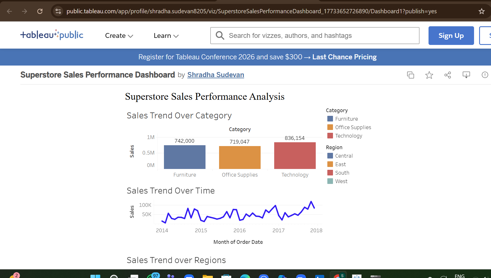

# Superstore Sales Performance Dashboard

## Overview
This project is an interactive Tableau dashboard analyzing sales performance across product categories, regions, and time trends using the Superstore dataset.

## Tools Used
- Tableau Public
- Data Visualization
- Business Analytics

## Key Insights
- Technology category generates the highest sales.
- West region shows the strongest sales performance.
- Sales demonstrate a steady upward trend over time.

## Dashboard
View the interactive dashboard here:
https://public.tableau.com/app/profile/shradha.sudevan8205/viz/SuperstoreSalesPerformanceDashboard_17733652726890/Dashboard1
